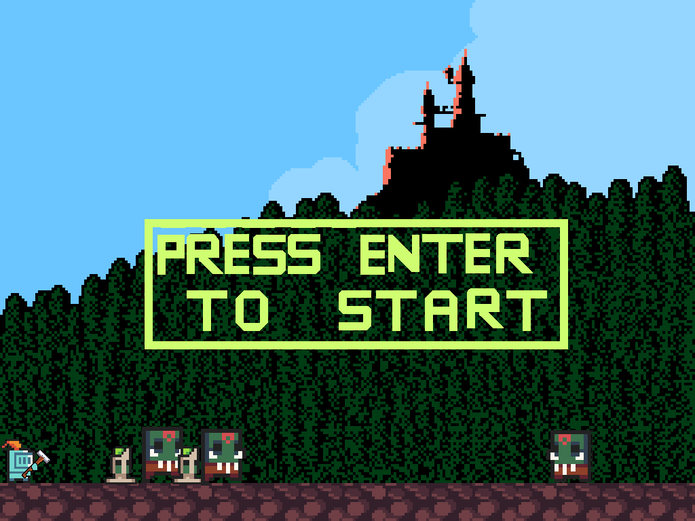
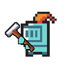
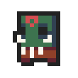
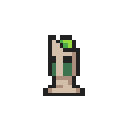
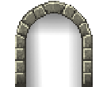
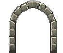
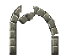
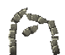
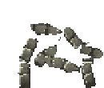
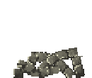

# Monster Gate Defense 게임

이 프로젝트는 대학생 3명이 협력하여 약 2개월 동안 개발한 자바 Swing 및 AWT를 기반으로 만든 게임입니다.
플레이어는 마을로 침입하려는 몬스터(enemy)를 막기 위해 문(gate)을 파괴해야 합니다. 모든 그래픽(캐릭터, 배경, 애니메이션)은 팀원 중 한 명이 직접 제작하였습니다.

---



## 게임 개념

- **목표**: 몬스터(enemy)가 마을에 들어오는 것을 방지합니다. 문(gate)을 공격하여 파괴하고, 몬스터가 생성되지 않도록 해야 합니다.
- **게임 플레이**:
  - 플레이어 캐릭터를 좌우로 움직이고 점프하며 문과 상호작용합니다.
  - 문을 공격하여 파괴합니다.
  - 문이 파괴되지 않으면 몬스터가 생성되고, 몬스터가 왼쪽 벽에 도달하면 플레이어의 목숨이 줄어듭니다.
  - 제한 시간(60초) 내에 마을을 방어해야 합니다.

---

## 주요 기능

- **플레이어 이동**: 부드러운 좌우 이동, 점프 및 공격 기능을 제공합니다.
- 
- 
- **적 AI**: 몬스터(enemy)는 문에서 생성되어 마을 쪽으로 이동합니다.
- 

- **문 생성**: 문은 랜덤 위치에서 생성되며 체력(HP)을 가지고 있습니다. 플레이어는 문을 공격하여 파괴해야 합니다.
- 





- **타이머**: 60초의 제한 시간이 있으며, 제한 시간 내에 마을을 방어해야 합니다.
- **목숨 시스템**: 플레이어는 3개의 목숨으로 시작하며, 몬스터가 마을로 들어오면 목숨이 줄어듭니다.
- 
- **사운드 효과**: 게임 플레이 배경 음악과 시작 화면 배경 음악을 제공합니다.
- **시각적 요소**: 화면 우측 상단에 플레이어의 목숨과 안내 메시지를 표시합니다.

---

## 파일 구조

각각의 Java 파일은 게임의 특정 요소를 담당합니다. 아래는 각 파일에 대한 간단한 설명입니다.

1. **`BGM.java`**: 게임 플레이 중 배경 음악을 관리합니다.
2. **`StartBGM.java`**: 시작 화면에서의 배경 음악을 재생합니다.
3. **`CountDown.java`**: 60초 카운트다운 타이머를 관리하며, 시간이 끝나면 게임이 종료됩니다.
4. **`GateFrame.java`**: 게임의 메인 클래스. 게임 창을 초기화하고, 키보드 입력 및 게임 객체를 관리합니다.
5. **`Gate.java`**: 맵에서 랜덤 위치에 생성되는 문을 정의합니다. 문은 체력을 가지고 있으며, 파괴되지 않으면 몬스터를 생성합니다.
6. **`Enemy.java`**: 적(몬스터)의 동작을 정의하며, 문에서 생성되어 플레이어와 상호작용합니다.
7. **`Player.java`**: 플레이어 캐릭터의 이동, 점프, 공격 동작을 정의합니다.
8. **`PlayerDirection.java`**: 플레이어와 적의 방향(왼쪽, 오른쪽)을 나타내는 열거형 클래스입니다.
9. **`Movable.java`**: `Player`와 `Enemy`의 움직임 인터페이스를 정의합니다.
10. **`BackGroundPlayerService.java`**: 플레이어의 벽 충돌 및 바닥 감지를 위한 백그라운드 스레드입니다.
11. **`BackGroundEnemyService.java`**: 적의 벽 충돌 감지 및 왼쪽 벽 도달 시의 처리를 담당하는 백그라운드 스레드입니다.
12. **`LifeCount.java`**: 플레이어의 남은 목숨 수를 표시하고 관리합니다. 목숨이 0이 되면 게임이 종료됩니다.
13. **`Head.java`**: 플레이어의 목숨을 나타내는 아이콘을 화면 우측 상단에 표시합니다.
14. **`InsertCoin.java`**: "I" 키를 눌러 목숨을 추가하는 방법을 화면에 텍스트로 표시합니다.

---

## 플레이 방법

1. **게임 시작**:
   - `GateFrame` 클래스를 실행합니다.
   - 시작 화면에서 `Enter` 키를 눌러 게임을 시작합니다.
2. **조작법**:
   - `←`: 왼쪽 이동
   - `→`: 오른쪽 이동
   - `↑`: 점프
   - `Space`: 공격
   - `I`: 코인을 넣어 목숨 3개 추가
3. **게임 목표**:
   - 문을 파괴하여 몬스터가 생성되지 않도록 합니다.
   - 제한 시간(60초) 동안 마을을 방어합니다.
4. **승리 조건**:
   - 제한 시간 동안 마을을 성공적으로 방어합니다.
5. **패배 조건**:
   - 플레이어의 목숨이 모두 소진되면 게임이 종료됩니다.

---

## 설치 및 실행

1. **클론**
   ```bash
   git clone https://github.com/LuckyPlace/GateDefense.git
